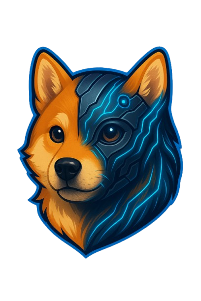

# DogiX Token Creator

A powerful, user-friendly web application for creating and deploying ERC20 tokens on the BNB Smart Chain (BSC) without requiring any coding knowledge.

## 🌟 Features

- **Simple Token Creation**: Create your own ERC20 tokens with just a few clicks
- **Web-Based Interface**: No downloads or installations required - use directly from your browser
- **Secure Wallet Integration**: Connect MetaMask for secure token deployment
- **Token Customization**:
  - Custom token name and symbol
  - Flexible decimal precision (1-18)
  - Configurable total supply
- **Network Support**:
  - BNB Smart Chain Mainnet (Chain ID: 56)
  - BNB Smart Chain Testnet (Chain ID: 97)
- **Real-time Balance Checking**: Verify your DOGIX token balance before deployment
- **Transaction Tracking**: View contract addresses and transaction hashes
- **Explorer Integration**: Direct links to blockchain explorers

## 🚀 Getting Started

### Prerequisites

- Node.js 16.x or higher
- npm or yarn package manager
- MetaMask wallet extension installed in your browser

### Installation

1. Clone the repository:
```bash
git clone https://github.com/ayanmal1k/DogiX.git
cd DogiX
```

2. Install dependencies:
```bash
npm install
```

3. Create a `.env.local` file in the root directory with the following variables:
```
NEXT_PUBLIC_WALLET_CONNECT_PROJECT_ID=your_project_id
NEXT_PUBLIC_RPC_URL=https://bsc-dataseed1.binance.org
NEXT_PUBLIC_TESTNET_RPC_URL=https://data-seed-prebsc-1-b7b35de5.binance.org:8545
```

4. Start the development server:
```bash
npm run dev
```

5. Open [http://localhost:3000](http://localhost:3000) in your browser

## 💰 Token Creation Requirements

To create a token, you need:
- **Minimum Balance**: 100,000 DOGIX tokens
- **BSC Network**: Connected to BNB Smart Chain (Mainnet or Testnet)
- **Gas Fees**: Sufficient BNB for transaction fees

## 📋 How to Use

1. **Connect Wallet**: Click "Connect MetaMask" button
2. **Verify Balance**: Ensure you have at least 100,000 DOGIX tokens
3. **Fill Token Details**:
   - Enter your token name (e.g., "AI Wizard")
   - Enter your token symbol (e.g., "AIWIZ")
   - Set decimal places (typically 18)
   - Specify total supply
4. **Deploy**: Click "Deploy Token" button
5. **Confirm**: Approve the transaction in MetaMask
6. **Success**: View your contract address and transaction hash

## 🔐 Security

- Smart contract-based token creation using OpenZeppelin ERC20 standards
- Secure wallet connection via MetaMask
- No private keys stored or transmitted
- All transactions on the blockchain for transparency

## 🛠️ Technology Stack

- **Frontend**: Next.js 14, React, TypeScript
- **Styling**: Tailwind CSS, Shadcn UI
- **Blockchain**: Wagmi, ethers.js, Web3.js
- **Wallet**: MetaMask integration
- **Smart Contracts**: Solidity (ERC20 standard)

## 📁 Project Structure

```
├── src/
│   ├── app/              # Next.js app directory
│   ├── components/       # React components
│   │   └── ui/          # UI component library
│   ├── hooks/           # Custom React hooks
│   ├── lib/             # Utility functions and smart contracts
│   ├── providers/       # Context providers (Wallet, Theme)
│   └── styles/          # Global styles
├── public/              # Static assets
├── package.json         # Dependencies
└── next.config.mjs      # Next.js configuration
```

## 📚 Smart Contract

The ERC20 token contract is located in `src/lib/erc20.sol` and includes:
- Standard ERC20 interface compliance
- Burn functionality
- Pause mechanism
- Access control

## 🌐 Networks Supported

### BNB Smart Chain Mainnet
- Network ID: 56
- Explorer: https://bscscan.com

### BNB Smart Chain Testnet
- Network ID: 97
- Faucet: https://testnet.binance.org/faucet-smart
- Explorer: https://testnet.bscscan.com

## 💡 Features Coming Soon

- [ ] Multi-chain token deployment (Ethereum, Polygon, etc.)
- [ ] Token lock functionality
- [ ] Liquidity pool creation
- [ ] Advanced token customization options
- [ ] Token migration tools

## 📄 Documentation

For detailed information about:
- **Token Economics**: See [Dogix Whitepaper](./public/Dogix_Whitepaper_Full.pdf)
- **Technical Details**: Check the [Technical Documentation](./public/dogix%20technical.png)
- **Roadmap**: View the project roadmap in the application

## 🤝 Contributing

We welcome contributions! Please feel free to submit a Pull Request.

## 📞 Support

For support and questions:
- Visit our website (link in social section)
- Check the FAQ section in the application
- Review the technical documentation

## 🔗 Links

- **Website**: [DogiX](https://dogix.io)
- **Contract Address**: `0x99d01f21FfD34916F21c7474F1B376168833a8F5`
- **PancakeSwap**: [Buy DOGIX](https://pancakeswap.finance/swap?outputCurrency=0x99d01f21FfD34916F21c7474F1B376168833a8F5)

## 📜 License

This project is licensed under the MIT License - see the LICENSE file for details.

## ⚠️ Disclaimer

- Always verify contract addresses before interacting
- Test on testnet before deploying to mainnet
- This tool is provided as-is without warranties
- Users are responsible for their own security and transactions

## 👨‍💻 Development

### Build for production:
```bash
npm run build
```

### Run production build:
```bash
npm start
```

### Lint and format:
```bash
npm run lint
```

---

**Made with ❤️ by the DogiX Team**

*Version 1.0.0 - January 2026*

